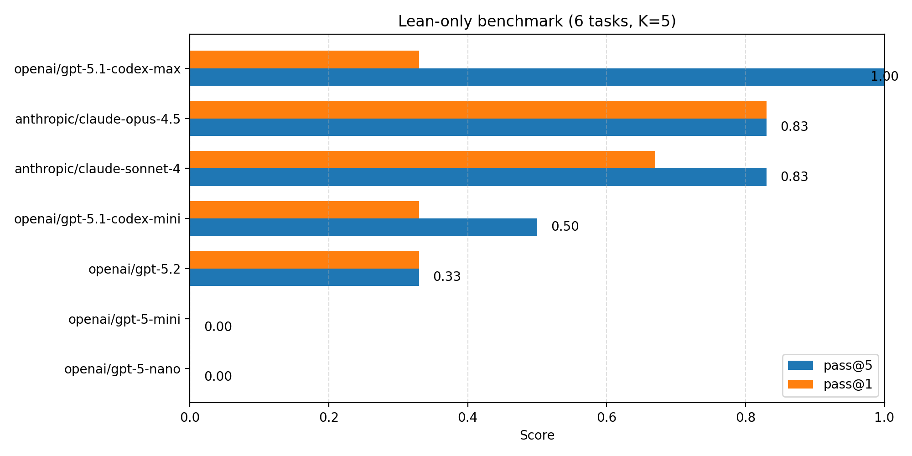

# LocalEval Bench

A production-ready local benchmark for routing and scoring model performance across
logic checks, code refactors, math lemma synthesis, and Lean-style proof sketches.

## Highlights

- Multi-task suite: MD logic, Python refactors, synthesis, Lean
- Multi-sample scoring: pass@1, pass@K, average pass rate
- Optional routing between models (logic vs code)
- OpenRouter-ready adapter for fast model swapping
- Reproducible reports: JSON, CSV, and Markdown summaries

## Quickstart

```bash
python -m venv .venv && source .venv/bin/activate
pip install -r requirements.txt

# OpenRouter (recommended)
cp .env.example .env
# set OPENROUTER_API_KEY in .env
set -a && source .env && set +a

export LOCAL_EVAL_MODEL_CMD="python scripts/openai_cli.py --model {model} --task {task_type} --task-id {task_id}"
python harness/run_eval.py --model openai/gpt-5.2
```

You can also use the installed CLI after `pip install -e .`:

```bash
local-eval --model openai/gpt-5.2
```

## Running the benchmark

Common runs:

```bash
# Full benchmark (md, py, synth, lean)
python harness/run_eval.py --model openai/gpt-5.2

# Lean-only
python harness/run_eval.py --model openai/gpt-5.2 --task-types lean --reports-dir reports_lean

# Five samples (default) with explicit K
python harness/run_eval.py --model openai/gpt-5.2 --max-tries 5

# Auto-route: code vs logic
python harness/run_eval.py --model openai/gpt-5.2 --codegen openai/gpt-5.1-codex-max --auto-route
```

Reports are written to `reports/summary.md`, `reports/metrics.json`, and `reports/metrics.csv`
(or your chosen `--reports-dir`).

## Metrics

- pass@1: fraction of tasks solved on the first attempt
- pass@K: fraction of tasks solved in any of K attempts
- avg pass rate: average success rate over K attempts
- time-to-fix: time from first failure to first success (if any)
- coverage: from `coverage report` on Python tasks

## Known results (Lean-only, K=5)

Latest Lean-only run (6 tasks, 5 attempts each). pass@1 = first attempt success; pass@5 = success in any of 5 attempts.

| Model | pass@1 | pass@5 | avg pass rate |
| --- | --- | --- | --- |
| openai/gpt-5.1-codex-max | 0.33 | 1.00 | 0.50 |
| anthropic/claude-opus-4.5 | 0.83 | 0.83 | 0.80 |
| anthropic/claude-sonnet-4 | 0.67 | 0.83 | 0.73 |
| openai/gpt-5.1-codex-mini | 0.33 | 0.50 | 0.20 |
| openai/gpt-5.2 | 0.33 | 0.33 | 0.30 |
| openai/gpt-5-mini | 0.00 | 0.00 | 0.00 |
| openai/gpt-5-nano | 0.00 | 0.00 | 0.00 |

Diagram (pass@5, higher is better):



To regenerate the chart: `python scripts/plot_known_results.py` (requires matplotlib).

Note: gpt-5.1-codex-mini, gpt-5-mini, and gpt-5-nano results are from a retry run after initial failures.

## Task types

- `md`: short prove/disprove logic checks with edge cases
- `py`: refactors plus unit tests (model must output a unified diff)
- `synth`: short lemma + proof sketch (1-2 paragraphs)
- `lean`: Lean-style theorem statement + proof sketch (ASCII only)

## Repository layout

```
harness/        runner, router, graders
scripts/        model adapter(s)
tasks/          md, py, synth, lean
reports/        generated outputs
README.md       usage and overview
```

## Adding tasks

- `tasks/md/*.md`: add a `<!-- rubric: ... -->` block with must/should checks
- `tasks/synth/*.md`: same rubric format, longer output expected
- `tasks/lean/*.lean`: use `/- rubric: ... -/` and ASCII-only Lean code
- `tasks/py/<task>/impl.py` and `tests.py`: provide seed code and tests

## Model adapters

The default adapter is `scripts/openai_cli.py`:

```bash
export OPENROUTER_API_KEY="..."
export OPENROUTER_SITE="https://your-site.example"   # optional
export OPENROUTER_TITLE="LocalEval"                  # optional
export LOCAL_EVAL_MODEL_CMD="python scripts/openai_cli.py --model {model} --task {task_type} --task-id {task_id}"
```

OpenRouter uses `https://openrouter.ai/api/v1/chat/completions` by default
and supports optional headers for attribution.

## Security

Never commit real API keys. Use `.env` locally and keep `.env.example` as a template.

## License

MIT. See `LICENSE`.

## Contributing

Please see `CONTRIBUTING.md` for setup and submission guidelines.

## Security

Please see `SECURITY.md` for reporting vulnerabilities.

## Citation

If you use this benchmark in academic or technical work, please cite it via
`CITATION.cff`.

## More docs

- `docs/BENCHMARK.md`
- `docs/ADDING_TASKS.md`
- `docs/ROUTING.md`
